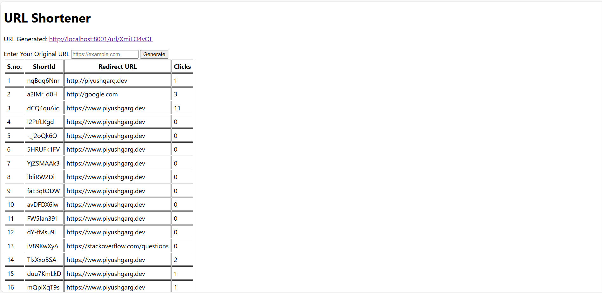

# URL Shortener

A simple URL shortener built with **Node.js**, **Express**, **MongoDB**, and **EJS**.  
Generates unique short URLs for any given long URL and tracks the number of clicks.

## Features

- Generate a short URL for any valid long URL
- Track the number of clicks for each short URL
- View all URLs in a table with click statistics
- Realtime updates for newly generated URLs
- Clean and minimal UI with EJS

## Tech Stack

- Node.js
- Express.js
- MongoDB (Mongoose)
- EJS for templating
- ShortID for generating unique IDs

## Installation

Clone the repository:

```bash
git clone https://github.com/sud-git/url-shortener.git

Navigate to the project folder:

cd url-shortener


Install dependencies:

npm install


Make sure MongoDB is running locally on mongodb://localhost:27017/short-url
Or update the connection string in connect.js.

Start the server:

Open your browser and go to:

http://localhost:8001


Usage

Enter any long URL in the input field
Click Generate to create a short URL
The table below shows all short URLs with click counts
Clicking the short URL redirects to the original URL and updates the click count
Every click on Generate creates a new short URL, even for the same original URL.


Project Structure

.
├── controllers
│   └── url.js            
├── models
│   └── url.js           
├── routes
│   ├── staticRouter.js   
│   └── url.js           
├── views
│   └── home.ejs          
├── screenshots
│   └── homepage.png      
├── index.js              
├── connect.js         
├── package.json
└── .gitignore


Notes

visitHistory in MongoDB stores timestamps of each click

node_modules and .env are excluded via .gitignore

Duplicate URLs are allowed; every submission creates a new short URL


Screenshot



